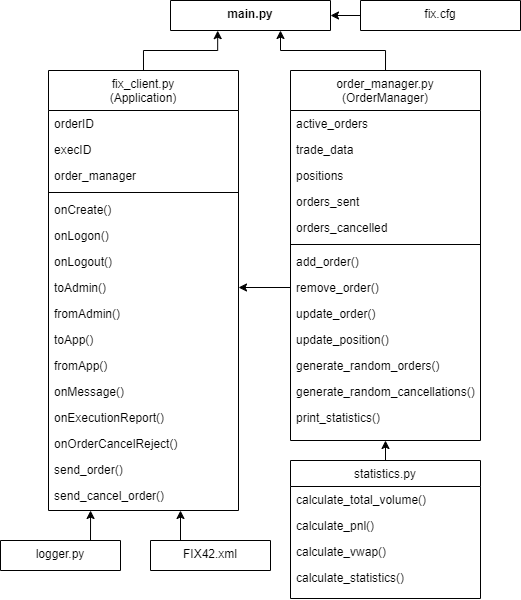

# FIX Client Application

## Description

The Financial Information Exchange (FIX) Protocol is a message standard developed to facilitate the electronic exchange of information related to securities transactions, and is used by popular exchanges such as NYSE and NASDAQ.

This FIX client application is based on the FIX 4.2 protocol specification, communicates with the the exchange/counterparty acceptor, capable of sending 1000 order requests, have them filled, and cancel those that are unfilled, all within a 5-minute period. The application is built using Python version 3.9.13 and the [QuickFIX package](https://quickfixengine.org/c/), with the Python interface binding calling the wrapped C++ to offer better performance. Please find the system design `diagram` in the folder as well.



## Instructions for Installing and Running the App

### Prerequisites

- Python 3.9.13
- QuickFIX 1.15.1 (requires Microsoft C++ build tools)

### Steps

1. **Create a virtual environment for Python**:
    ```bash
    python -m venv venv
    ```

2. **Activate the virtual environment**:
    - On Windows:
        ```bash
        .\venv\Scripts\activate
        ```
    - On macOS and Linux:
        ```bash
        source venv/bin/activate
        ```

3. **Install packages from `requirements.txt`**:
    ```bash
    pip install -r requirements.txt
    ```

4. **Navigate to the `src` directory**:
    ```bash
    cd src
    ```

5. **Run the application**:
    ```bash
    python main.py
    ```

## App Configuration and Design

### Client

The `client.py` file contains the communication logic for handling messages to and from the server. It manages the session with logon/logout handshakes, heartbeats, handles the application messages, and processes the responses from the server.

### Order Manager

The `order_manager.py` file manages the state of the orders upon `NEW`, `FILLS`, `PARTIAL_FILLS`, and `CANCELLED` `ExecType` and handles order cancellations. It keeps track of active orders, trade positions, and trade data. It also generates random orders and cancellations, and prints the trading statistics.

### Statistics

The `statistics.py` file contains helper functions for calculating statistics for the trades, such as total volume, PNL, and VWAP.

### Configuration Changes

- The `DataDictionary` `FIX42.xml` file has been modified to remove certain required fields that the server does not send. Comments have been left for the 9 fields that were changed.
- The original `FIX42_raw.xml` file is included in the `spec` folder for reference.

## Possible Improvements

1. **Extension to Options, Strategies and Combos**:
Extend the application to handle options and combination trades with multiple legs.

2. **Python Dictionary vs pandas DataFrame**:
For the purposes of this project, we used dictionary as it is faster for smaller use cases like these. For future extensions of the project functionalities (such as database connections, table joins or graphing), pandas DataFrame can be implemented instead.

3. **Additional Metrics**:
Include other metrics typically kept in a trading book, beyond the current three (total volume, PNL, VWAP), such as risk measures and more detailed PNL breakdowns.

4. **Sell Order Restrictions**:
The application currently allows selling something not in the book. We may implement restrictions to only allow selling items present in the book, except for short selling.

5. **Graphical Visualizations**:
Add graphical visualizations for trade statistics, such as PNL over time, using libraries like Matplotlib or Plotly.
